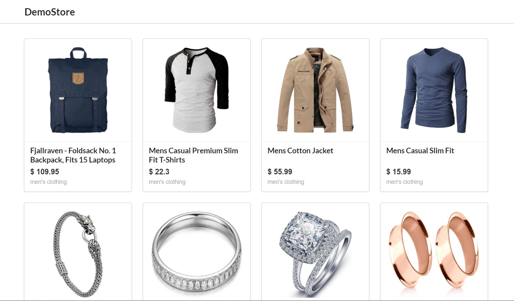

# Demo Store App 

## Description 
Basic Replica of E-commerce product page.

API [Link](https://fakestoreapi.com/)



### My learnings
1. Redux 
2. React Router 

### Tech Stack 
React, CSS 

Libraries:
- axios: for fetching data from the API
- react-redux: useDispatch, useSelector, Provider
- redux: createStore, combineReducers
- react-router-dom: useParams, BrowserRouter, Switch, Route, Link

Framework: 
- Semantic UI

## Installation 
```bash 
git clone https://github.com/anshulraheja/DemoStore-react-redux.git
npm install
```